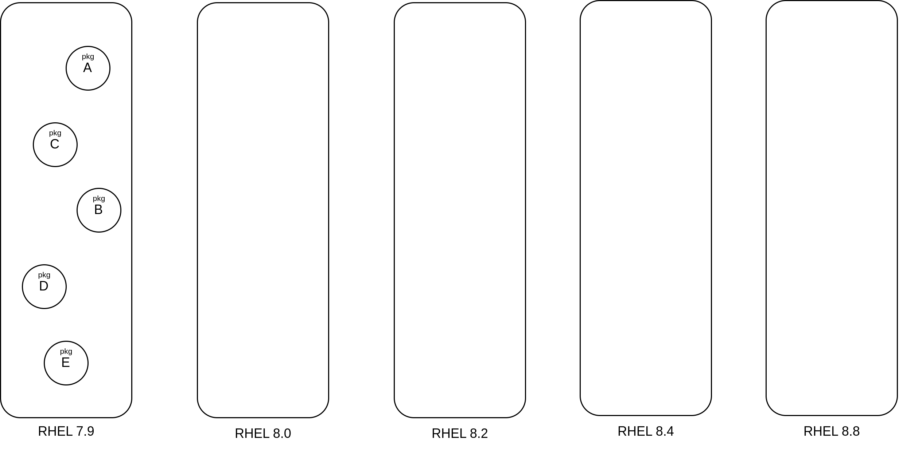
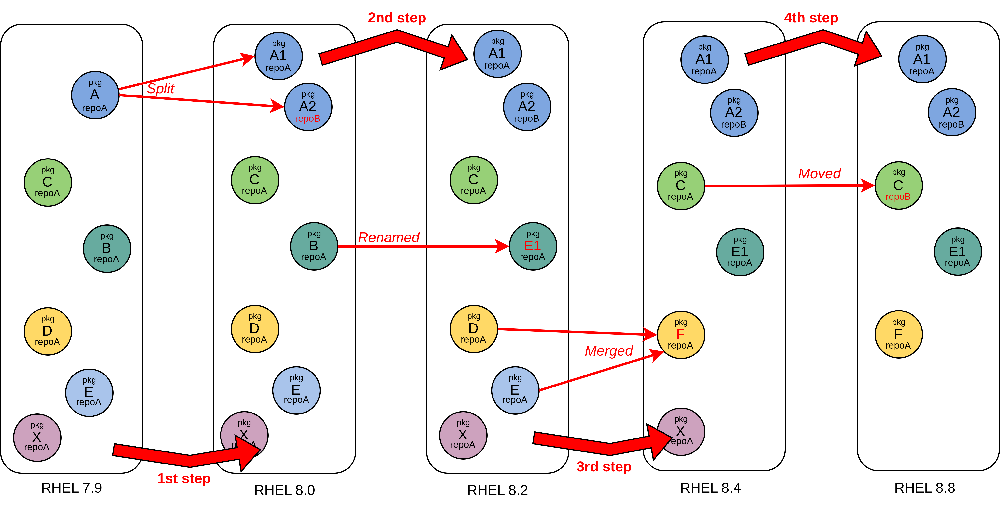

# How leapp handles PES events
Package Evolution Service (PES) events contain valuable information about
how packages change between major (and minor) releases of RHEL. It is likely
that without these events the post-upgrade system would not be functionally
equivalent to the pre-upgrade one. For example, the system might be missing
key applications that the user expects to be installed, because they were
renamed during RHEL evolution and DNF was not able to determine what to install
instead. PES events provide leapp with this missing information, which is then
processed and fed to the DNF transaction performed during the upgrade. This
article describes how leapp's algorithm that processes PES events and produces
streamlined output to DNF.

## How does leapp's algorithm work
We start with a high-level picture of how leapp processes PES events, ignoring
what precisely it means to "apply" an event. First, leapp looks at all the
events and determines what RHEL releases are mentioned by the available PES
events between the source RHEL version (e.g. RHEL 7.9) and the target RHEL
version (e.g. RHEL 8.8). As will be shown later, each event contains information
about when (between which RHEL releases) did the change described by the event
happen. To illustrate, assume that the events refer only to RHEL 8.0, RHEL 8.2,
RHEL 8.4, RHEL 8.8 (in their `to_release` fields).



After collecting RHEL releases that were significant for the evolution of
packages, leapp computes the set of installed packages in a
release-after-release fashion. Using the list of installed packages (that are signed by
RedHat) as a starting point, all events that have their `to_release` equal to the
next oldest unprocessed RHEL release are applied in an arbitrary order. Thus,
leapp computes the set of packages that would be installed on RHEL 8.0 in order
to have a functionally equivalent of the source system. Using this computed set
as a basis for the next-release step, leapp again collects all events for RHEL
8.2 and applies them, thus producing a set of installed packages facilitating
a equivalent RHEL 8.2. The process is repeated until leapp computes a set of
packages for the upgrade target, i.e., RHEL 8.8.



### Applying events in an uniform fashion
Skipping over some technical details, each PES event can be thought of as a data structure with 4 fields:
 - `action` - what happened to the packages that the event refers to
 - `in_pkgs` -  what were the inputs to the action
 - `out_pkgs` - what were the outputs of the action
 - `to_release` - in which RHEL release was the change effective

Now `in_pkgs` are not just a list of package names (strings). Instead, a Package
contains also information about the repository in which the package resides,
and also some information related to (DNF) modularity. Finally, to complete
the picture, the action field can have 8 kinds of actions, i.e. it is one of
the following:

| Action type | Type ID | Description                                                                                                            |
|---          | ---     | ---                                                                                                                    |
|Present      |	0       |	The package is a part of RHEL compose with version `to_release`, and it can be found in RHEL repositories            |
|Removed      |	1       |	The package has been removed in a given release, subsequent RHEL release do not contain this package in repositories |
|Deprecated   |	2       |	The package has been deprecated, but it is still available from repositories                                         |
|Replaced     |	3       |	Package(s) from `in_pkgs` are replaced by packages in `out_pkgs`                                                     |
|Split        |	4       |	A given package has been split into multiple packages listed in `out_pkgs`                                           |
|Merged       |	5       |	Multiple packages present in `in_pkgs` were merged into a single package                                             |
|Moved        |	6       |	A package has been moved to a different repository                                                                   |
|Renamed      |	7       |	A package is renamed                                                                                                 |

A JSON scheme describing the format in which events are stored in `/etc/leapp/files/pes-events.json` is
[available here](https://github.com/oamg/schema-test/blob/main/pes-events-schema-test.json).

Clearly, the action types were designed so that the events serve the purpose
of documenting the evolution, rather then serving as an input for a machine
algorithm (leapp). In other words, the actual effect of an event can be handled
in an uniform fashion, regardless of the event action type.

Hence, when applying an event with `in_pkgs = X` and `out_pkgs = Y`, where `X` and
`Y` are two sets of packages, leapp ignores event `action` field, and
applies the event roughly as:
```python
next_release_pkgs = set(current_release_pkg).difference(X).union(Y)
```

For example, let the processed event be `Event(in_pkgs={pkgA}, out_pkgs={pkgB,
pkgC}, action=SPLIT, to_release=8.0)` and the RHEL 7.9 packages would
be `current_release_pkgs = {pkgA, pkgD}`. Thus, applying the event would
produce a new set with `pkgA` removed, and `pkgB`, `pkgC` added:
```
{pkgA, pkgD}.difference({pkgA}).union({pkgB, pkgC}) = {pkgD}.union({pkgB, pkgC})
                                                    = {pkgB, pkgC, pkgD}
```

Therefore, the complete step between two evolution-significant releases can be computed simply as:
```python
next_release_pkgs = set(current_release_pkgs)  # Modified gradually
for event in events_matching_to_release:
    next_release_pkgs = next_release_pkgs.difference(event.in_pkgs).union(event.out_pkgs)
```

#### The only exception - Presence events
Events with `action = Present` don't quite fit into the above framework. Indeed,
if we were to treat them in the same (unconditional) fashion, leapp would be
installing some packages that might seem random from user perspective just
because it has information that such a package is present in a certain RHEL
release. Therefore, leapp keeps a set `seen_pkgs` of all packages that were present in some
of the package sets that would be installed if the upgrade target was some older
RHEL release. Presence events are applied only if the referred package would be
installed (present in the `seen_pkgs`) as it is necessary to facilitate expected functionality.
